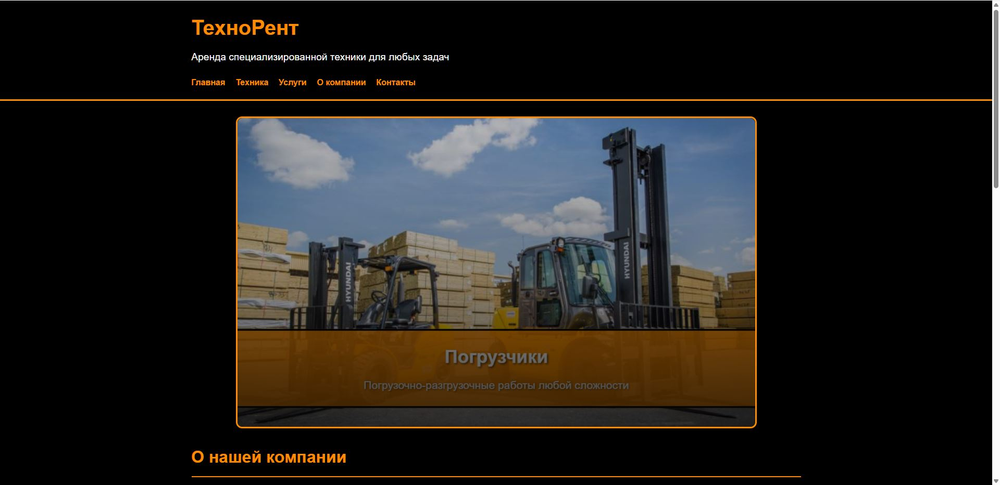
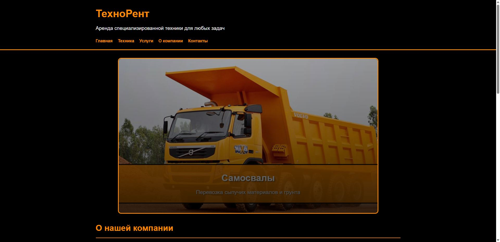
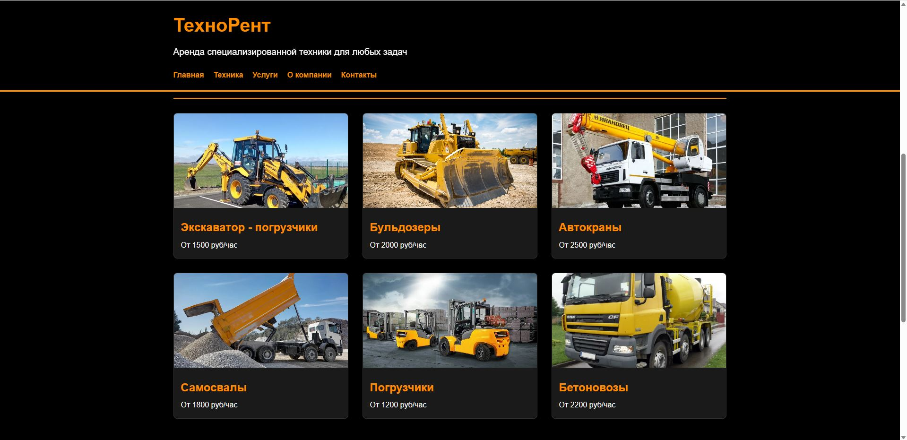

# 🚜 DemoRent — Демо сайт аренды спецтехники

Демонстрационный сайт аренды специализированной техники.  
Проект создан в учебных и демонстрационных целях для показа структуры коммерческого лендинга и приёмов современной вёрстки.

🔗 **Онлайн демо:** [Посмотреть на GitHub Pages](https://hoadf.github.io/Rental-of-special-machinery-and-equipment/)  
💾 **Исходный код:** [Репозиторий на GitHub](https://github.com/hoadf/Rental-of-special-machinery-and-equipment)

---

## 🖼️ Превью

---

## 📸 Скриншоты

| Главная | Техника | Услуги |
|----------|----------|---------|
|  |  |  |

---

## 💡 О проекте

DemoRent — демонстрационный проект, показывающий, как может выглядеть современный сайт компании по аренде спецтехники.  
Сайт включает основные разделы:  
- главную страницу с баннером и навигацией;  
- секции с описанием услуг и парком техники;  
- плавную анимацию появления блоков при прокрутке;  
- адаптивную вёрстку под мобильные устройства.  

Первая версия сайта оформлена в фирменных цветах (чёрный и оранжевый), имитируя промышленный стиль.  
Все изображения взяты из открытых источников и используются исключительно в демонстрационных целях.

---

## 🧩 Технологии

- **HTML5** — структура и контент  
- **CSS3** — стилизация и адаптивность  
- **JavaScript (ES6)** — анимации и плавная прокрутка  

---

## 📤 Хостинг

Сайт опубликован с помощью **GitHub Pages**.  
Работает локально без серверной части.

---

## 📄 Лицензия

Проект опубликован под лицензией **MIT**.  
Использование кода допускается в учебных и демонстрационных целях.

---

✉️ **Автор проекта:** *HOADF*  
💬 **Направление:** создание сайтов и веб-приложений, интеграция с ChatGPT, Python-разработка, визуализация в Blender.
